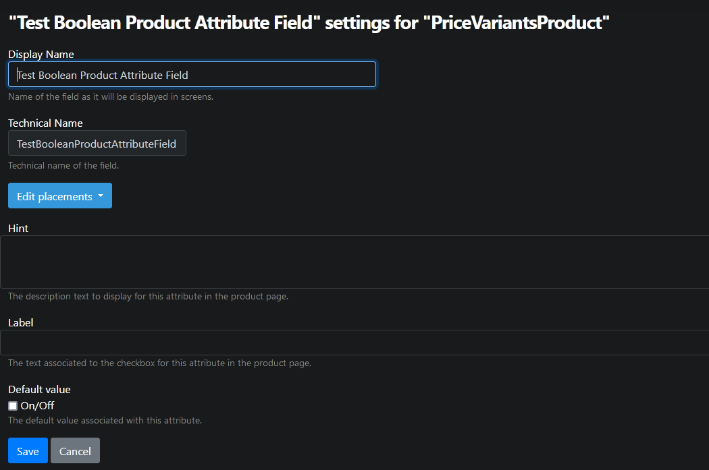
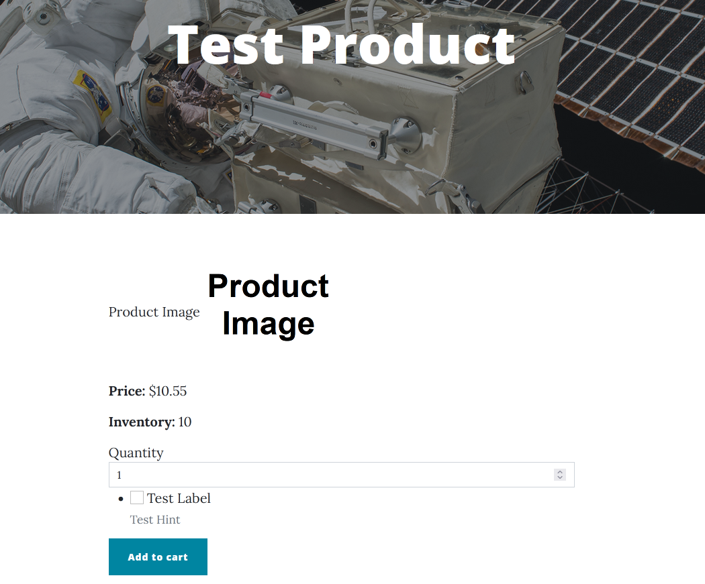

# BooleanProductAttributeField

Adds a checkbox so the buyer can communicate some kind of yes/no choice about their purchase. Currently this attribute is not supported for price variant creation.

## Fields and properties

- **Hint** (`string`): Sets the description text to display for this attribute on the product's page.
- **DefaultValue** (`T`): Sets the default value.
- **Label** (`string`): Sets the text associated to the checkbox for this attribute on the product page.

## Usage examples

New attribute fields can be added or existing fields can be edited in the relevant product content type's editor.

Attribute fields are displayed on the product's page.

