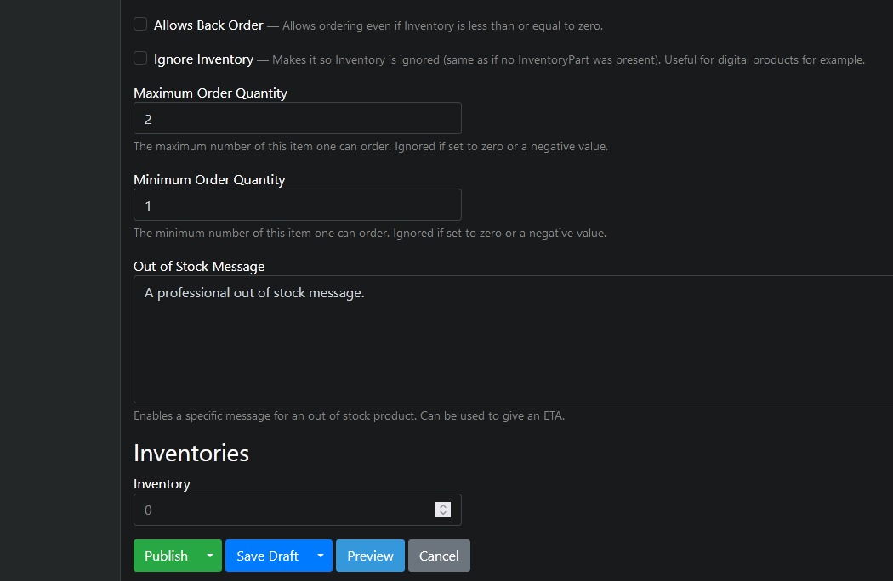
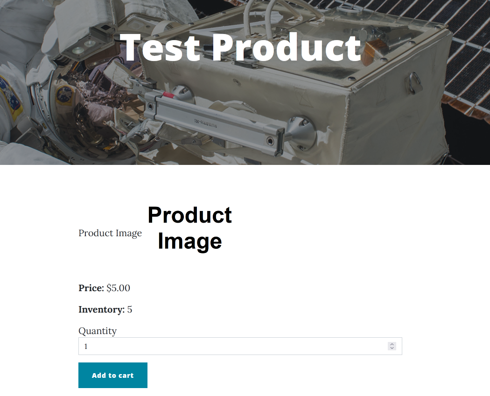
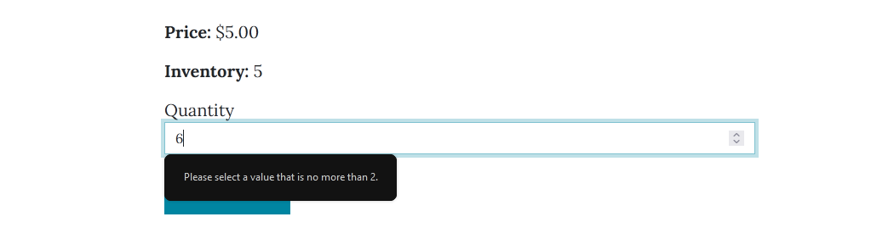
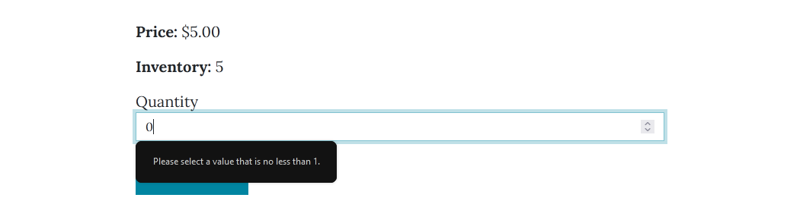
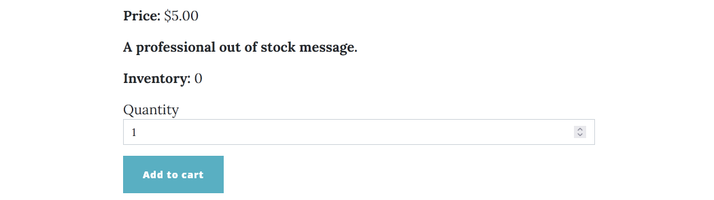

# InventoryPart

The InventoryPart adds basic inventory management capabilities to a product. Requires [ProductPart](product-part.md) to be present on the content type as well.

## Fields and properties
- **AllowsBackOrder** (`BooleanField`): When set to true, product can be ordered even when the Inventory field's value is below 1.
- **IgnoreInventory** (`BooleanField`): When set to true, all inventory checks (within [InventoryShoppingCartEvents](https://github.com/OrchardCMS/OrchardCore.Commerce/blob/main/src/Modules/OrchardCore.Commerce/Events/InventoryShoppingCartEvents.cs)) are bypassed.
- **Inventory** (`IDictionary<string, int>`): Sets the number of available products. Uses a `Dictionary<string, int>` object to keep track of multiple inventories (which is mostly relevant for products with a [PriceVariantsPart](price-variants-part.md) attached to them).
- **MaximumOrderQuantity** (`NumericField`): Determines the maximum amount of products that can be placed in an order. Also sets the upper limit for the Quantity input on the product's page. This field is ignored if its value is set to 0 or below.
- **MinimumOrderQuantity** (`NumericField`): Determines the minimum amount of products that can be placed in an order. Also sets the lower limit for the Quantity input on the product's page. This field is ignored if its value is set to 0 or below.
- **OutOfStockMessage** (`HtmlField`): Enables providing a specific message for an out of stock product. Defaults to "Out of Stock".

By default, the below fields' shapes are empty, so they do not show up on the user-facing part of the site:
- AllowsBackOrder
- IgnoreInventory
- MaximumOrderQuantity
- MinimumOrderQuantity

## Usage examples
All the inventory-related settings can be found in the product's editor.

With a product's inventory set to a valid value, the current inventory count will appear on the product's page.

With a maximum order quantity specified, trying to add more products to the cart than allowed will result in a validation error.

With a minimum order quantity specified, trying to add fewer products to the cart than allowed will result in a validation error.

With a custom out of stock message provided, the message will show up on the product's page when its inventory is below 1 and back ordering is not allowed.

