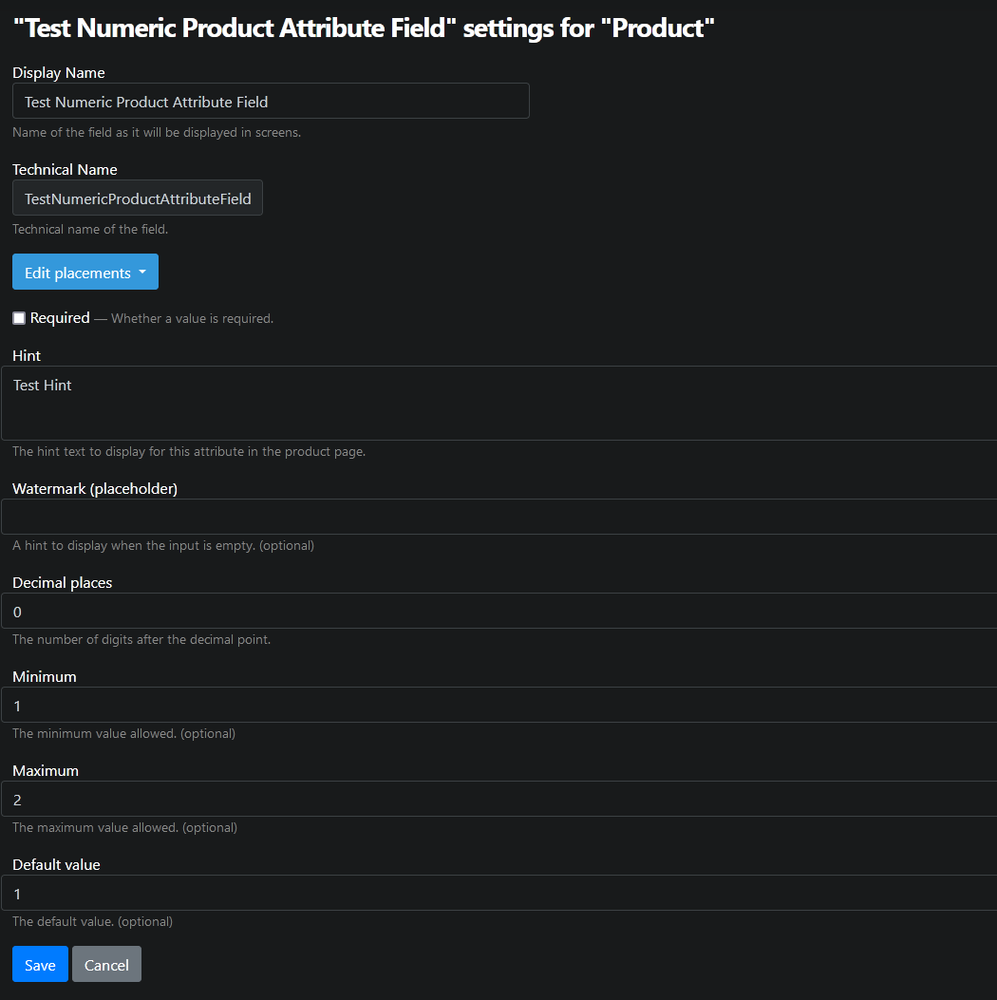
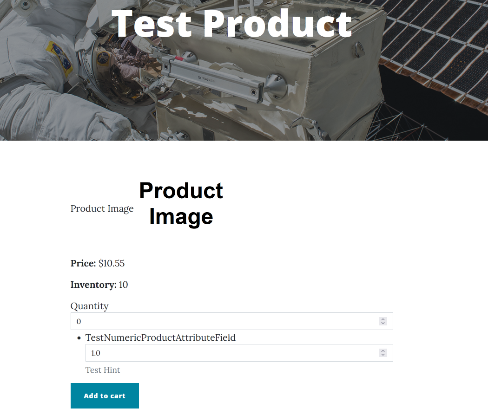

# NumericProductAttributeField

This is currently unsupported — while the attributes do show up on the product's page, they serve no purpose for the time being.

## Fields and properties
- **Hint** (`string`): Sets the description text to display for this attribute on the product's page.
- **DefaultValue** (`T`): Sets the default value.
- **Required** (`bool`): Determines whether a value is required.
- **Placeholder** (`string`): Sets the hint to display when the input is empty.
- **DecimalPlaces** (`string`): Sets the number of digits possible after the decimal point.
- **Minimum** (`string`): Determines the minimum value allowed.
- **Maximum** (`string`): Determines the maximum value allowed.

## Usage examples
New attribute fields can be added or existing fields can be edited in the relevant product content type's editor.

Attribute fields are displayed on the product's page.

