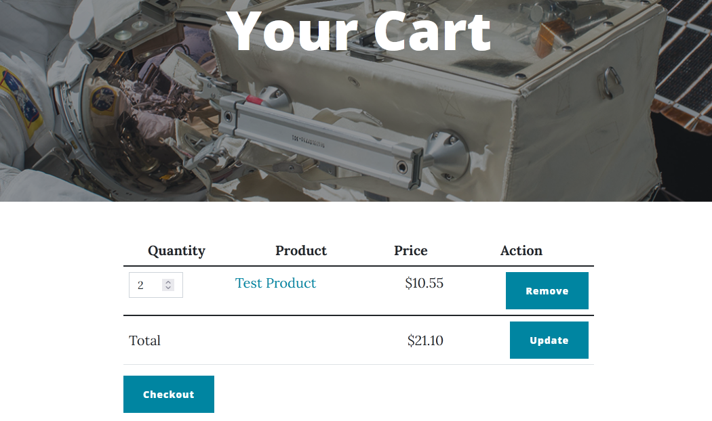

# PricePart

Provides a single price to a product using a custom [PriceField](https://github.com/OrchardCMS/OrchardCore.Commerce/blob/main/src/Modules/OrchardCore.Commerce/ContentFields/Models/PriceField.cs).

## Fields and properties
- **PriceField** (`PriceField`): Sets the base price of a product using a decimal number and a currency. The final price of a product may differ based on tax settings.

## Usage examples
The product's price can be set in the product's editor.

The product's price appears on the product's page, showing the specified decimal value and currency.

Price is also shown in the cart once the product has been added.

