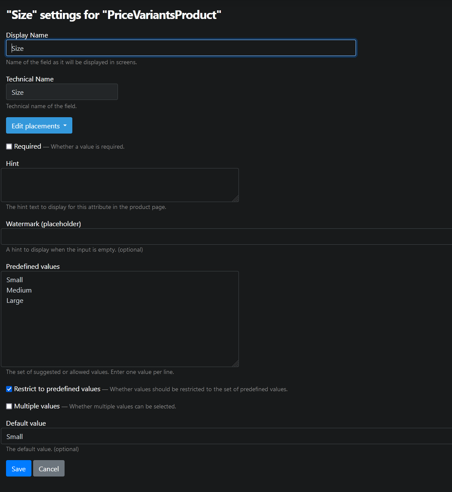
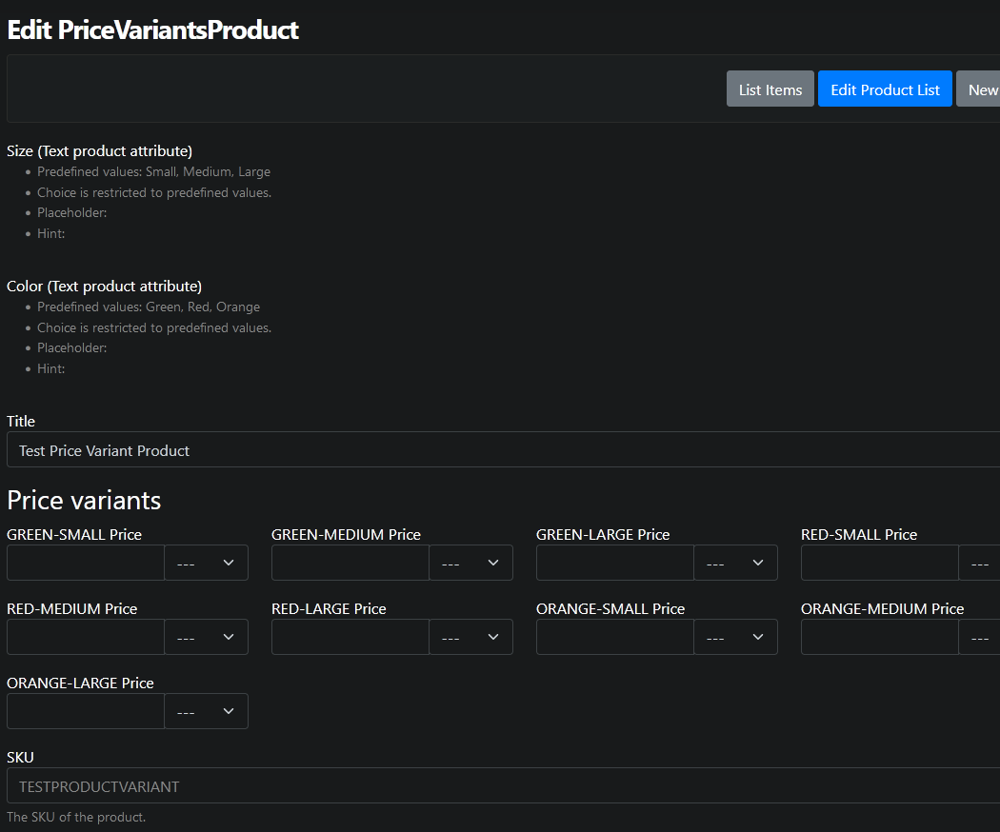
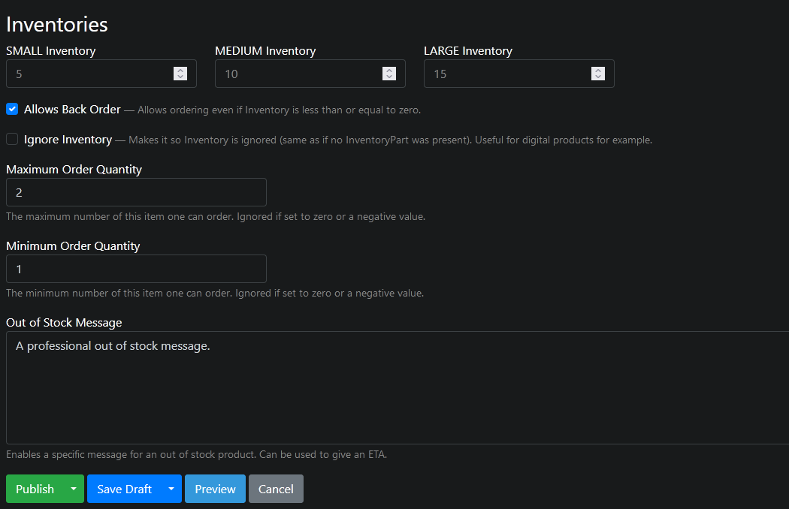
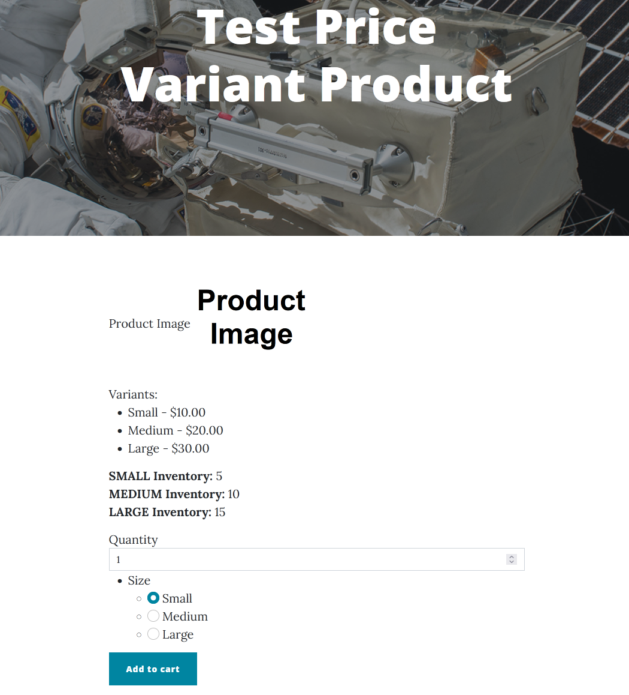

# PriceVariantsPart

Provides multiple prices to a product based on predefined attributes. This currently only supports [TextProductAttributes](text-product-attribute.md) that are restricted to predefined values.

If [InventoryPart](inventory-part.md) is present, there will be multiple separate inventories for the variants.

In case of multiple attribute fields on a content type, a price field will be created for each possible combination. Individual inventories can be created using a recipe, see the sample [Price Variant Product](https://github.com/OrchardCMS/OrchardCore.Commerce/blob/main/src/Modules/OrchardCore.Commerce/Recipes/OrchardCore.Commerce.Samples.Product.recipe.json#L145).

Adding or editing product attributes can be done in the content type's editor (see below).

## Fields and properties
- **Variants** (`IDictionary<string, Amount>`): This property stores each variant's SKU along with their price.

## Usage examples
New attribute fields can be added or existing fields can be edited in the content type's editor.

The prices of variants can be set in the content item's editor.

With InventoryPart present, the inventory of each variant can be set in the content item's editor.

On the product's page, a variant can be selected and added to the cart. If inventories exist, they are also displayed here.

