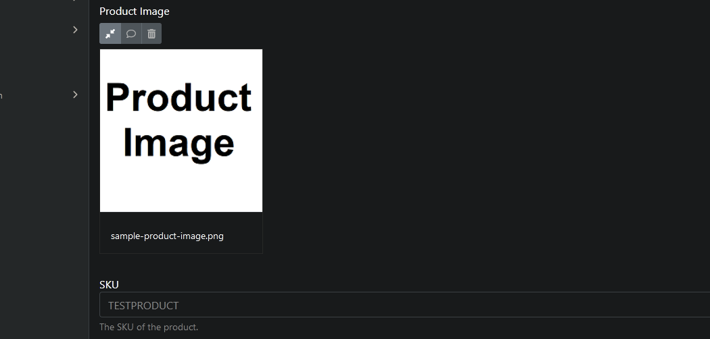
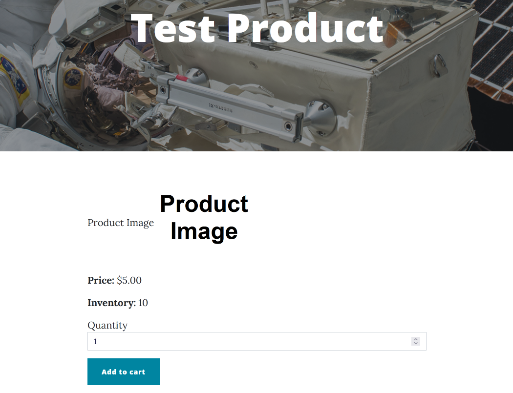

# ProductPart

The ProductPart, in tandem with a [PricePart](price-part.md) or a [PriceVariantsPart](price-variants-part.md), turns a content type into a product.

## Fields and properties
- **SKU** (`string`): The product's stock keeping unit, used for identification purposes. Must be globally unique and cannot contain the `-` character.
- **CanBeBought** (`IDictionary<string, bool>`): Determines whether the product can currently be bought based on current inventory settings. If there is no [InventoryPart](inventory-part.md) on the product, it is unused. This is not editable in the product's editor.
- **ProductImage** (`MediaField`): Allows selecting an image from the Media Library that will be displayed on the product's page.

## Usage examples
The SKU and the Product Image properties can be set in the product's editor.

If Product Image is set, it will appear on the product's page.

