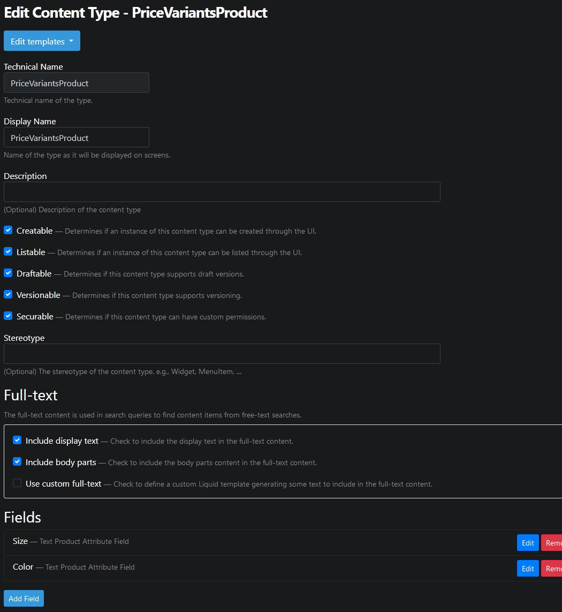
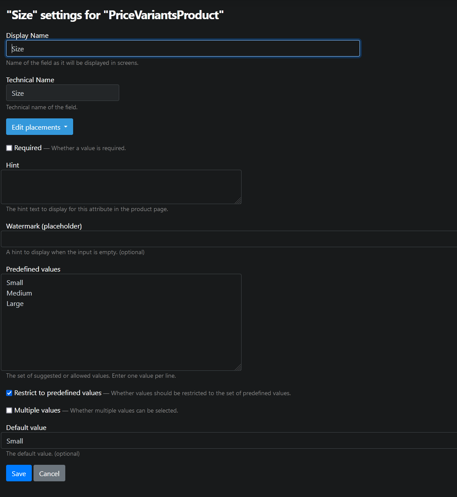

# TextProductAttributeField

Allows adding further details to a product. By default it is displayed as a text input, but this is modified by some of the properties below. When used in combination with a [`PriceVariantsPart`](price-variants-part.md) and restricted to predefined values, it creates variants for the product.

When not restricted to predefined values, it can be used to provide a text or note to the merchant. For example, in a clothing store it may be used to supply custom text to be printed on the item.

## Fields and properties

- **Hint** (`string`): Sets the description text to display for this attribute on the product's page.
- **Required** (`bool`): Determines whether a value is required.
- **DefaultValue** (`T`): Sets the default value.
- **Placeholder** (`string`): Sets the hint to display when the input is empty.
- **PredefinedValues** (`IEnumerable<object>`): Holds the set of allowed values. These are also used to create variants with a `PriceVariantsPart`.
- **RestrictToPredefinedValues** (`bool`): Determines whether values should be restricted to the set of predefined values. When true, the field is displayed as a list of radio buttons. Note that this must be set to true for `PriceVariantsPart` to pick up the values.
- **MultipleValues** (`bool`): Determines whether multiple values can be selected. This only makes sense when _RestrictToPredefinedValues_ is true. If enabled, the predefined values are displayed as a list of checkboxes.

## Usage examples

New attribute fields can be added or existing fields can be edited in the relevant product content type's editor.

The predefined values of the attribute are displayed on the product's page.

