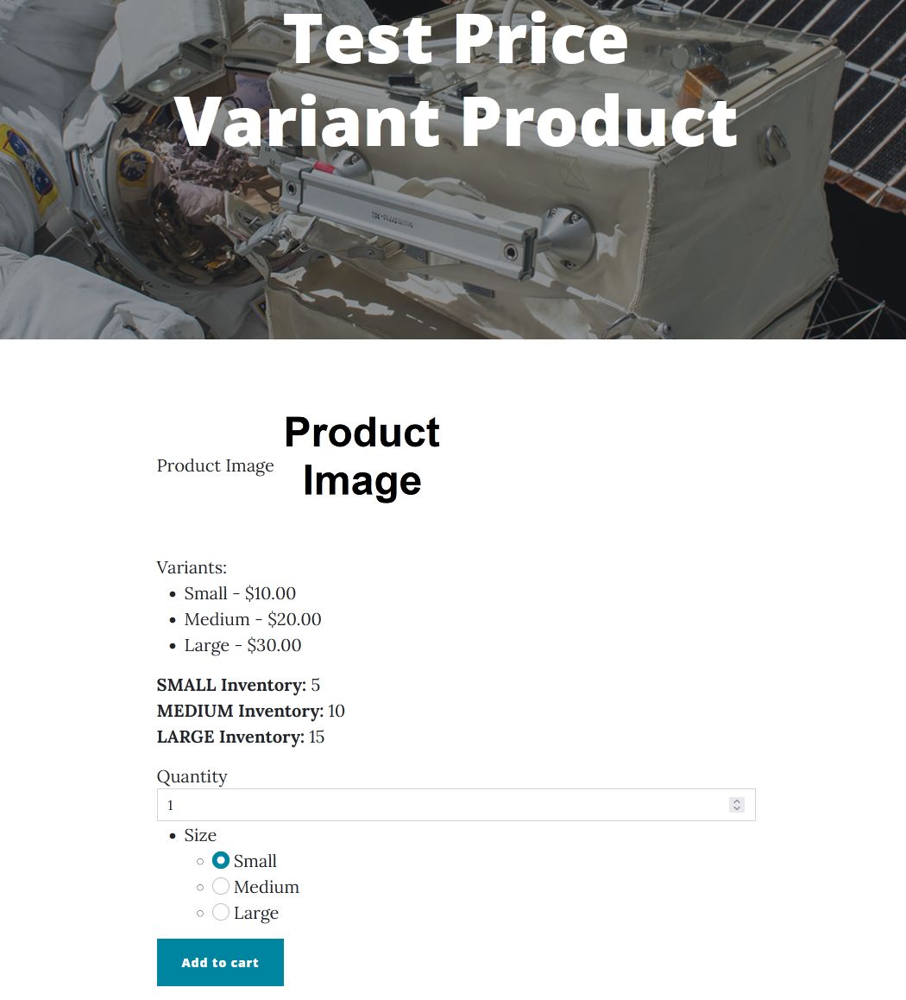

# TextProductAttributeField

When used with a [PriceVariantsPart](price-variants-part.md) on a product, the `TextProductAttributeField` allows adding further details to the product.

## Fields and properties
- **Hint** (`string`): Sets the description text to display for this attribute on the product's page.
- **Required** (`bool`): Determines whether a value is required.
- **DefaultValue** (`T`): Sets the default value.
- **Placeholder** (`string`): Sets the hint to display when the input is empty.
- **PredefinedValues** (`IEnumerable<object>`): Holds the set of allowed values. These are also used to create variants with a `PriceVariantsPart`.
- **RestrictToPredefinedValues** (`bool`): Determines whether values should be restricted to the set of predefined values. Note that this must be set to true for `PriceVariantsPart` to pick up the values correctly.
- **MultipleValues** (`bool`): Determines whether multiple values can be selected.

New attribute fields can be added or existing fields can be edited in the relevant product content type's editor.

The predefined values of the attribute are displayed on the product's page.

