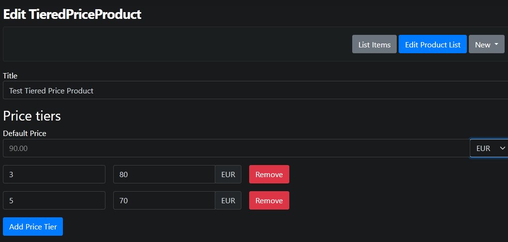
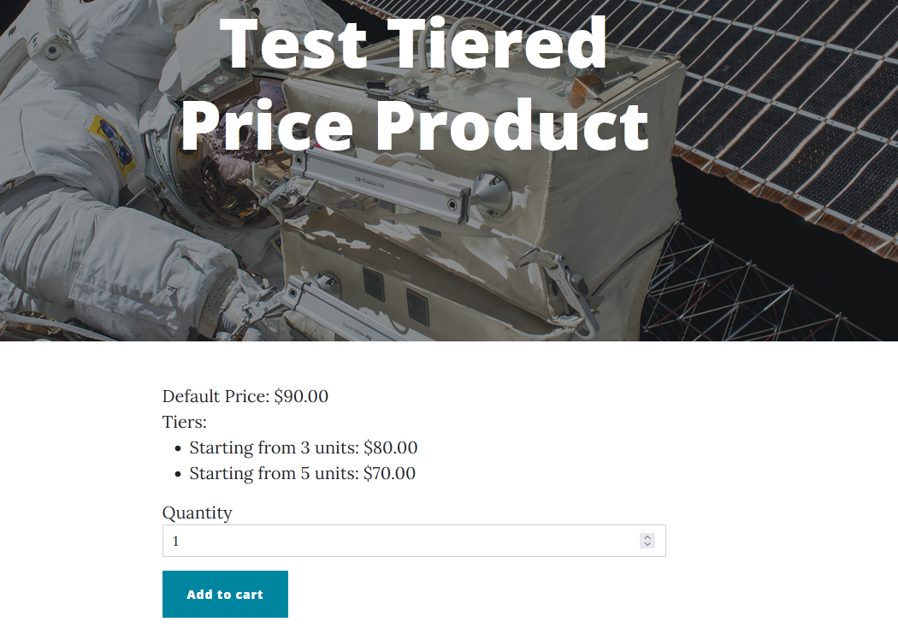
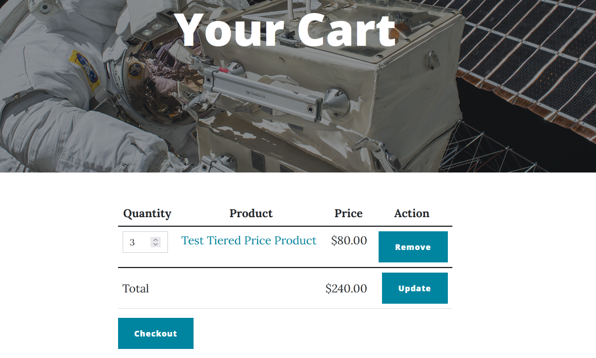

# TieredPricePart

Allows setting several prices for a product based on the quantity purchased at once.

## Fields and properties
- **DefaultPrice** (`Amount`): Sets the base price of the product, which will be applicable until the selected quantity reaches one of the specified tiers.
- **PriceTiers** (`IList<PriceTier>`): A list of [PriceTiers](https://github.com/OrchardCMS/OrchardCore.Commerce/blob/main/src/Modules/OrchardCore.Commerce/Models/PriceTier.cs) that determine which price to use at which quantity. The currency for these prices follow the currency set for the `DefaultPrice` property. If there are no tiers specified, the default price is used in all cases.

## Usage examples
The price tiers can be set in the product's editor.

The product's tiered prices appear on the product's page and modify the line price in the cart if applicable.

