# Creating a webshop using OrchardCore.Commerce

## Introduction

Orchard Core's [Commerce](https://github.com/OrchardCMS/OrchardCore.Commerce) module can be used to create a fully functional webshop in a few simple steps. Read on to learn how to set up a webshop featuring highly customizable products and online payment, including using key features such as order management, inventory management, promotions, and taxation.

The numbered steps below cover the most basic webshop needs. Read on beyond them for more functions and capabilities the Commerce module has to offer.

## Pre-requisites
- General familiarity with [Orchard Core](https://docs.orchardcore.net/en/latest) in general, see [Tutorials](https://docs.orchardcore.net/en/latest/docs/resources/tutorials/).
- An installed Orchard Core website

## Steps to create a basic webshop

### Step 1 — Install the Commerce module using NuGet
Get the latest version of the [Orchard Core Commerce NuGet](https://www.nuget.org/packages/OrchardCore.Commerce) package. Should you vie for further tips regarding NuGet usage with Orchard Core, see the [Getting Started](https://docs.orchardcore.net/en/latest/docs/getting-started) page.

### Step 2 — Enable necessary features
Certain Orchard Core Commerce features, as well as some pre-requisite stock Orchard Core features, need to be enabled for the necessary functionality. This can be done under *Configuration > Features*. These features include the following:
- **Orchard Core Commerce - Core**: Registers core components of Commerce features.
- **Orchard Core Commerce - Payment_** Provides the basics for online payment.
- **Orchard Core Commerce - Payment - Stripe**: Provides online payment implementation using Stripe.
- **Orchard Core Commerce - Session Cart Storage**: Provides shopping cart functionality.
- **Widgets**: Allows rendering widgets in zones.
- **Layers**: Allows rendering widgets across pages based on conditions.
- **Feeds**: Adds feeds capabilities.
- **Lists**: Adds a content type that can be used as a container.

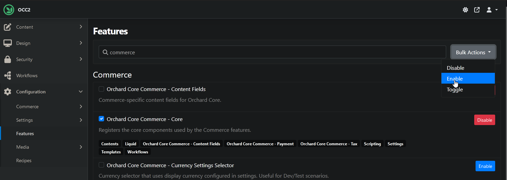
*Why click many button when few button do trick?*

Optionally, also enable other useful Commerce features as well to get even more out of your webshop. More on these later in the corresponding paragraph -- link to paragraph?
- **Orchard Core Commerce - Inventory**: Provides basic inventory management.
- **Orchard Core Commerce - Promotion**: Allows specifying discounts and promotions.
- **Orchard Core Commerce - Tax**: Provides tax-related functionality.
- **Orchard Core Commerce - Custom Tax Rates**: Enables locally maintaining tax rates.

### Step 3 — Create Shopping Cart Widget
Shopping without a shopping cart is like tanning without sunlight — it's not outside the realm of possibility, but sunlight is still preferable. Let's create our equivalent of sunlight in this step.
For this, we're going to need to create Zones, Layers, and finally a Widget.

- **Zones**:
Navigate to _Design > Settings > Zones_ and define the zone where you want the shopping cart widget to be rendered. Standard Orchard Core zones include Header, Content, and Footer, so it might be best to start with those. To learn more about Zones, refer to their [documentation](https://docs.orchardcore.net/en/main/docs/reference/modules/Layers/#zones).

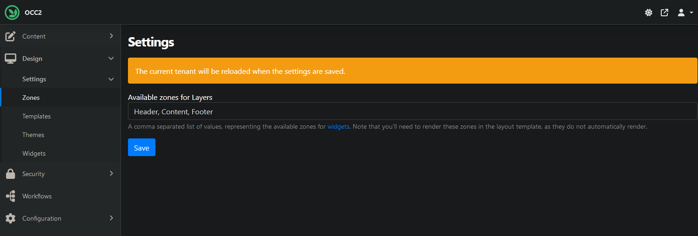

_Header, Content, Footer, any zone can be created here. Except for Ozone, that's illegal._

- **Layers**:
Go to _Design > Widgets_, then click the Add button to define a Layer.

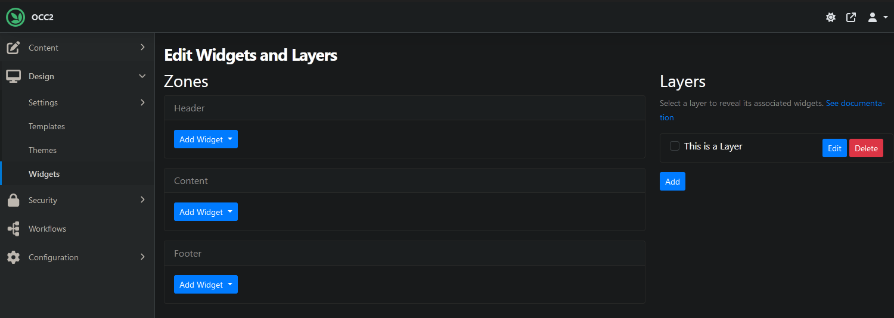

_The Add button right there on the right side, click it._

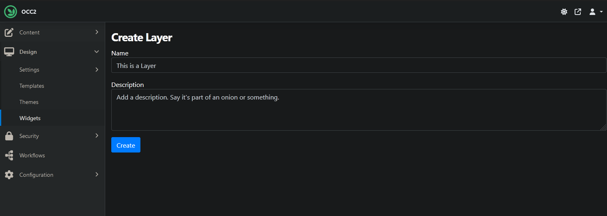

_The Layer needs to be saved first to reveal additional options._

Once saved, the Rules option becomes available, which contains various conditions that determine when the Layer is visible. For simplicity's sake, let's choose a Boolean condition with its value set to true — this ensures the Layer is always visible.

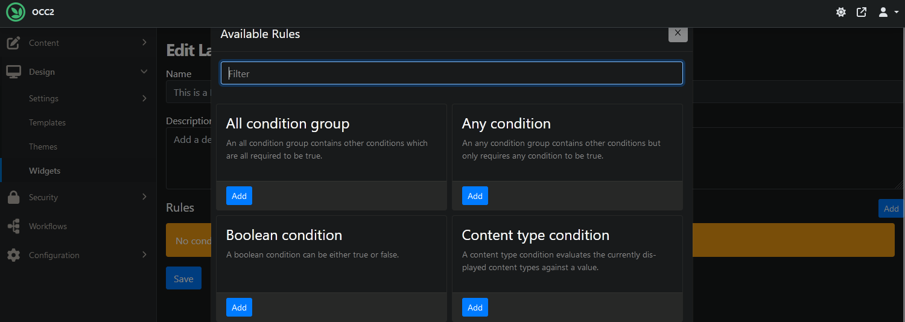

_There can be multiple Rules in place for one Layer, but a singular one will do for starting out._

- **Widget**:
Widgets are content items that have their stereotype set to Widget. As such, the Shopping Cart Widget can be created like any other content type. Go to _Content > Content Types_ and click Create New Type. Name it Shopping Cart Widget, save it, edit its settings, and specify its Stereotype as Widget. For more extensive documentation about Widgets, see the [usual place](https://docs.orchardcore.net/en/main/docs/reference/modules/Widgets/).

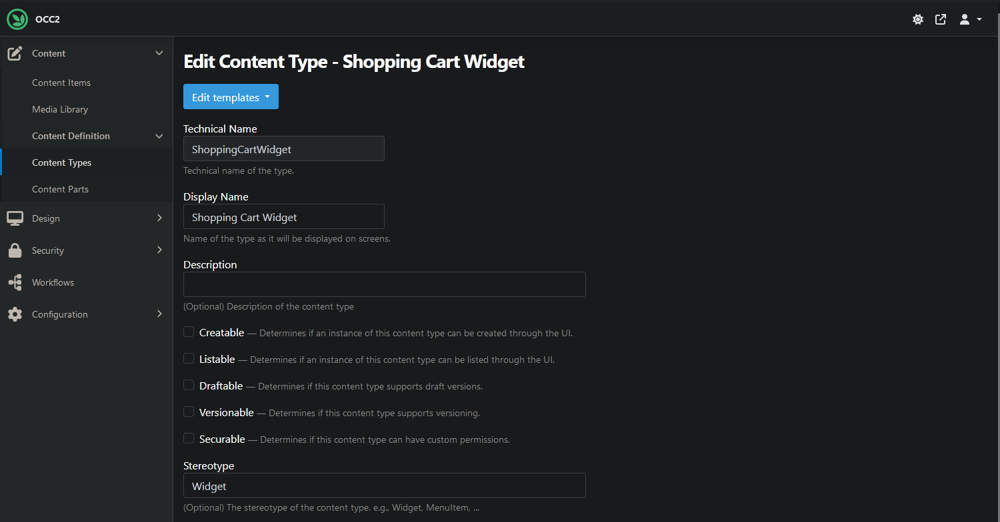

_The Shopping Cart Widget doesn't need to be Creatable, Listable, etc._

Once again on the _Design > Widgets_ page, it's time to finally add a Widget. To do so, click the Add Widget button that's within the Zone of your choice, and select Shopping Cart Widget.

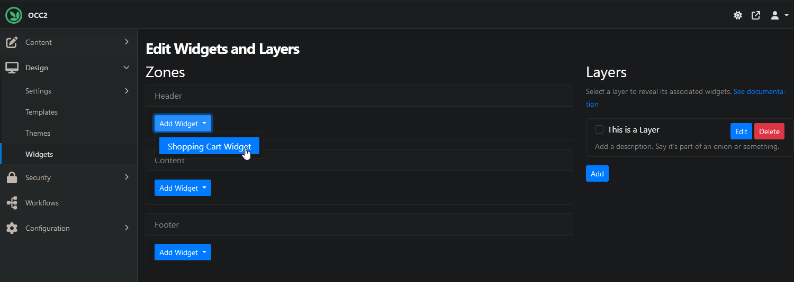

_Any content type with the Widget stereotype can be added this way, but let's just stick to the shopping cart._

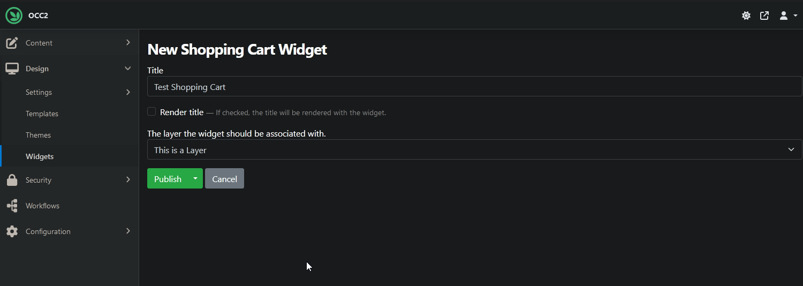

_Name the Widget and select the Layer where it should be rendered in._

### Step 4 — Create a product content type
Products are rather crucial to a webshop, so let's create a Product content type. Any content type that has a [`ProductPart`](https://github.com/OrchardCMS/OrchardCore.Commerce/blob/main/docs/features/product-part.md) and a price-providing part (e.g. [`PricePart`](https://github.com/OrchardCMS/OrchardCore.Commerce/blob/main/docs/features/price-part.md), [`PriceVariantsPart`](https://github.com/OrchardCMS/OrchardCore.Commerce/blob/main/docs/features/price-variants-part.md), or [`TieredPricePart`](https://github.com/OrchardCMS/OrchardCore.Commerce/blob/main/docs/features/tiered-price-part.md)) attached to it qualifies as a product. For a more technical overview of these parts, follow the links.

Navigate to _Content > Content Types_ and create a new type. Name it Product, attach `TitlePart`, `ProductPart`, and `PricePart` to it.

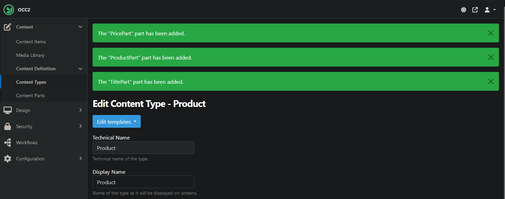

_It's okay to leave the rest of the settings on default, they can be changed anytime._

Now if you visit the item's page, you can add it to the cart.

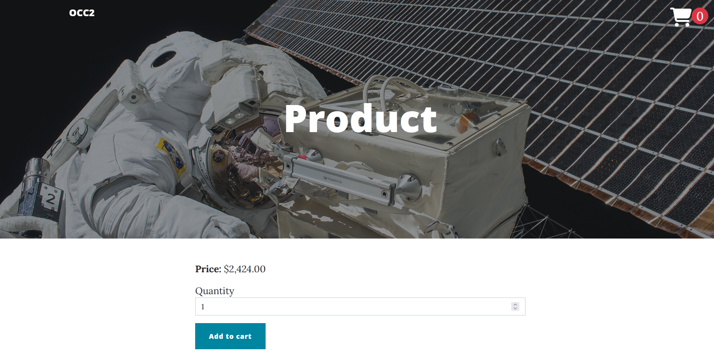

_A Product with excellent price to value ratio._

### Step 5 — Create a Product List
Listing the available products is another expected feature for a webshop. This can be done in multiple ways, but let's see a simple one that includes a content type which utilizes lists. Go to _Content > Content Types_ and create a new type with the name Product List. Add `TitlePart`, `ListPart`, and `AutoroutePart` to it. The basic settings are up to preferences, however, the `ListPart`'s contained types need to be specified in order to add Products to it.


_Set the contained types in the ListPart's settings._

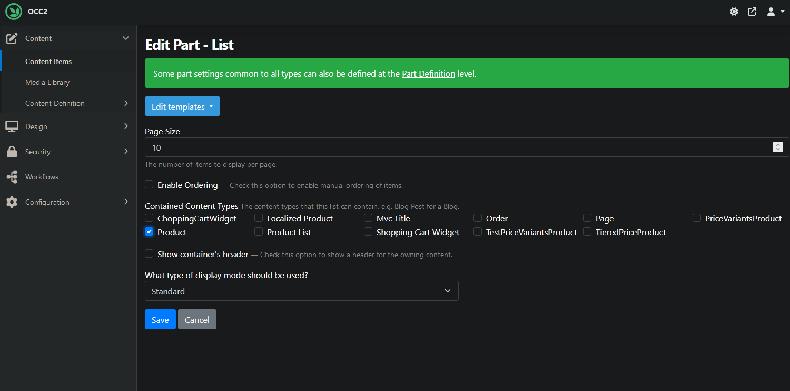

_As this is a list of Products, the Product type alone might do._

Optionally, edit the `AutoroutePart`'s settings to allow setting the Product List as the homepage.

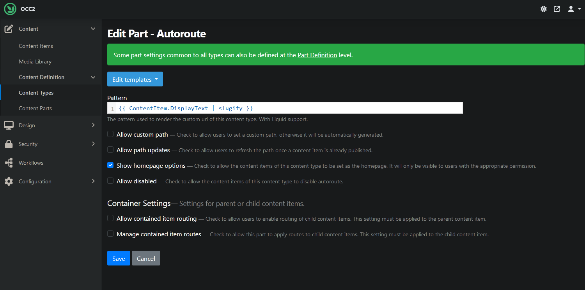

_Check Show homepage options. Or don't, up to you._

Now navigate to _Content > Content Items_ and create an item of the newly added type. Then, inside that item, add Products that you want to be listed.

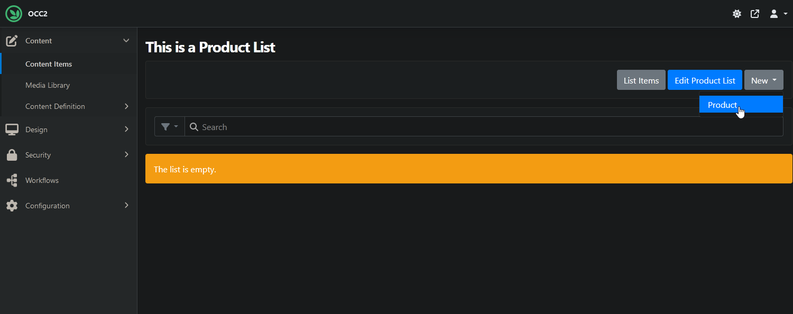

_Add a few Products to the list to have a few items to list._

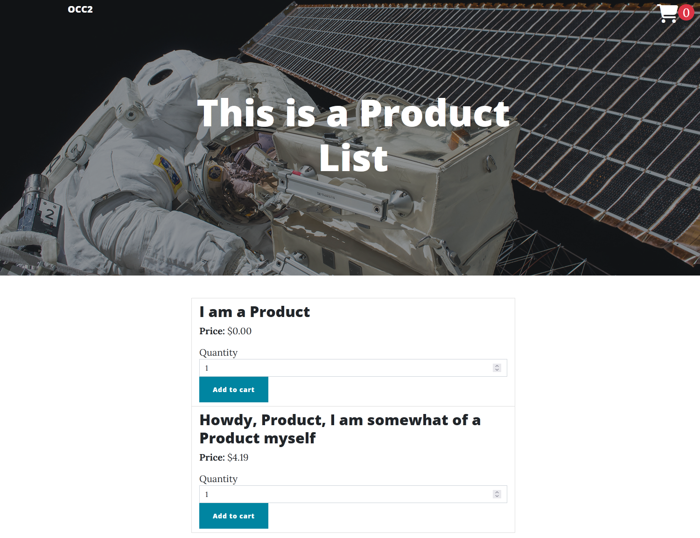

_Listing available Products makes browsing easier for customers._

### Step 6 — Enable a payment provider (Stripe)
Having Products and being able to browse them is great and all, but customers will also need a way to checkout and pay for their cart's content. This is where payment providers come into the picture. For simplicity's sake, we'll use Stripe as the payment provider here. Ensure the **Orchard Core Commerce - Payment - Stripe** feature is enabled, then go to _Configuration > Commerce > Stripe API_. The Publishable Key and Secret Key fields need to be filled in for the Stripe Payment form to work on the checkout page, see the links on the settings page for more.

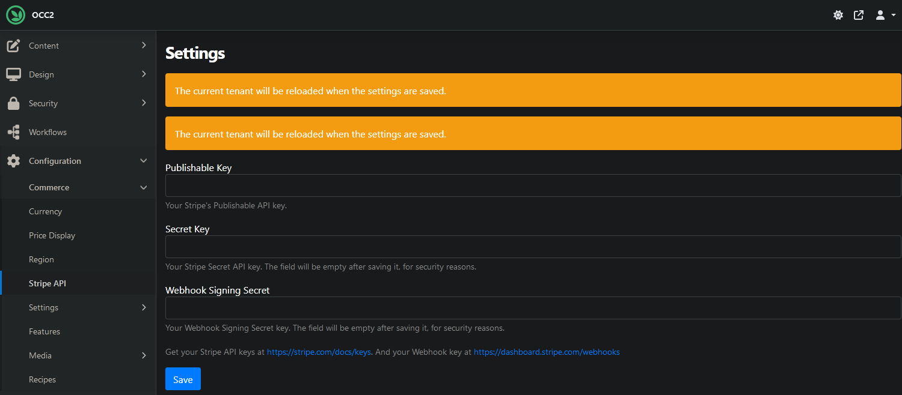

_If you don't already have the necessary API keys, follow the links._

With that done, the Stripe Payment form now appears on the checkout page, making checking out possible.

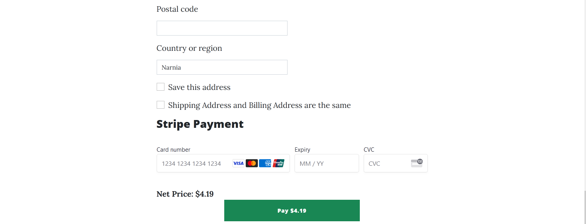

_This will allow customers to pay to their cart's content._

## Other useful Commerce features

### Order management
orders are automatically created when a user checks out
orders can also be created manually on the dashboard

### Price variant products
briefly explain what price variant products are and what they're good for, link to detailed documentation

### Taxation

### Promotions

### Inventory management

## Miscallaneous
## Video

<iframe width="560" height="315" src="https://www.youtube-nocookie.com/embed/yWpz8p-oaKg" title="YouTube video player" frameborder="0" allow="accelerometer; autoplay; clipboard-write; encrypted-media; gyroscope; picture-in-picture" allowfullscreen></iframe>


## Introduction

This article goes through the process of creating a fully functional decoupled CMS website that lets you edit Blog Posts and render them.

__Decoupled__ is a development model where the front-end and the back-end (administration) of the site are hosted in the same web application but only the back-end is driven by a CMS. Developers can then write their own ASP.NET Razor Pages or Controllers to have total control on what is generated by the website while still utilizing the CMS, in this case Orchard Core, to author content.

!!! note
    While this guide starts with a new project and uses Razor Pages you can use much of this guide to add Orchard Core as a content management back-end to any existing ASP.NET Core app too.


## Prerequisites

You should:

- Be able to create a new ASP.NET Core project
- Be familiar with C# and HTML
- Have the .NET SDK installed
- Have Visual Studio .NET or Visual Studio Code

## Setting up the project

### Creating the Orchard Core CMS Web Application

#### Option 1 - From Visual Studio .NET

Follow this option if you want to use Visual Studio .NET.  

- Open Visual Studio .NET.
- Create a new ASP.NET Core Web Application project.


- Enter a __Project name__ and a __Location__. For this tutorial we'll use "OrchardSite" for the name. Then click __Create__.
- Select the __Web Application__ template, leave everything else on default and click __Create__.

#### Option 2 - From the command line

From the folder where the project

- Type `dotnet new webapp -o OrchardSite` where "OrchardSite" is the name of the project to create.

This creates a Web application using Razor Pages.

### Testing the Website

- Start the project.

The newly created website should be able to run, and look like this:


### Adding Orchard Core CMS to the Website

- Double-click or edit the __.csproj__ file
- Modify the `<PropertyGroup>` section like this:

```xml
<PropertyGroup>
  <TargetFramework>net6.0</TargetFramework>
</PropertyGroup>
```

This will allow for the Razor Pages to be reloaded without the need to recompile them.

- Add a new `<ItemGroup>` section like this:

```xml
<ItemGroup>
  <PackageReference Include="OrchardCore.Application.Cms.Core.Targets" Version="1.7.2" />
</ItemGroup>
```
This will add the packages from Orchard Core CMS

- Edit the `Program.cs` file to configure OrchardCore CMS services like this:

```csharp
builder.Services.AddOrchardCms();
```

!!! warning "Razor Pages"
    `builder.Services.AddRazorPages()` must not be called directly as `builder.Services.AddOrchardCms()` already invokes it internally.

- Edit the `Program.cs` file
- Add `app.UseOrchardCore();` 
- If any of the following lines exists in your `Program.cs` file, remove them:

```csharp
  builder.Services.AddRazorPages();

  if (!app.Environment.IsDevelopment())
  {
      app.UseExceptionHandler("/Error");
      app.UseHsts();
  }
  
  app.UseHttpsRedirection();
  app.UseRouting();
  
  app.UseAuthorization();
  
  app.MapRazorPages();
}
```

Here is a sample of a bare minimum `Program.cs` file

```csharp
public class Program
{
    public static void Main(string[] args)
    {
        var builder = WebApplication.CreateBuilder(args);

        // Add services to the container.
        builder.Services.AddOrchardCms();

        var app = builder.Build();

        app.UseStaticFiles();
        app.UseOrchardCore();
        
        app.Run();
    }
}
```

Start the application, the Setup screen shows up:


### Setting up a new site

The Setup screen expects some information in order to create a new database
to store the content and user account.

- Enter a name for your site. In this example we'll use "My Site".
- In the __Recipe__ drop-down, select __Blank site__ which can be used for decoupled and headless modes.
- Select a time zone if the one detected is not correct. All date and times will be entered or rendered relatively to this time zone by default.
- Choose a database server. The easiest way to begin is by selecting __Sqlite__ as it won't require any other step from you.
- In the __Super User__ section, enter some accounts information or your choice. In this example we'll use `admin` as the user name.
- Click on __Finish Setup__.

After a couple seconds the same site as the original template should be displayed, with a "Welcome" message.

If you chose __Sqlite__, all the state of the application is now stored in a folder named `App_Data` inside your project's root folder.

> If something went wrong, try deleting the `App_Data` folder if it exists and go through this section again.

## Creating Blog Posts

This part covers the basic content management concepts of Orchard Core CMS, like __Content Types__ and __Content Items__.

### Content Modeling

In Orchard Core CMS most of the content that is managed is called a __Content Item__. A content item is a versioned document like a page, an article, a blog post, a news item, or anything you need to edit. Each of these documents are based on a __Content Type__ that defines which properties it is made of. For instance any article will have a title and some text. A blog post might also have tags. Orchard Core CMS lets you model the content types the way you want, which is known as _content modeling_.

!!! hint "For developers"
    A Content Type is analogous to a class, where a Content Item can be seen as an instance of a Content Type.

### Creating a Blog Post content type

Orchard comes pre-configured with a set of composable elements of data management called __Content Parts__ that can be used to create custom types like a LEGO. A __Title Part__ for instance will provide a nice editor to enter the title of a content item, and also set it to the text to display by default in the screens. Another important content part is the __Markdown Body Part__ which provides a way to store and render Markdown as the main text of a content item. This is also useful for a Blog Post.

!!! hint "For developers"
    A Content Part is analogous to a partial class, where each Content Parts are then aggregated to define a Content Type. Content Fields are analogous to custom properties that are added to the Content Type.

Let's create a new content type named `Blog Post` and add some necessary content parts to it:

- From the running website, open the url `/admin`.
- In the login screen, enter the user credentials that were used during the setup.
- You are presented with the administrative side of the site.
- In the left menu, select __Content Definition__ then __Content Types__.
- Click on __Create new type__ in the top right corner
- In __Display Name__ enter `Blog Post`. The __Technical Name__ will be generated automatically with the value `BlogPost`, like this:


- Click __Create__
- A list of __Content Parts__ is presented. Select __Title__ and __Markdown Body__, then click on __Save__


- In the following screen, scroll to the bottom of the page and re-order the Parts like this:


- Then click __Save__

You can notice an __Edit__ button in front of each content part. This lets us define some settings that might be available for each of them, only for this type.

- On the `MarkdownBody` part, click __Edit__.
- Select __`Wysiwyg editor`__ as the type of editor to use, then click __Save__:


The __Blog Post__ content type is ready to use.

### Creating blog posts

- In the left menu, select __New__ then click on __Blog Post__ to reveal an editor for the newly created `BlogPost` content type.


- Fill in the __Title__ and the __MarkdownBody__ form elements with some content, then click on __Publish__. For the sake of this example we'll use `This is a new day` and some Lorem Ipsum text.
- In the menu, click on __Content > Content Items__ to display all the available content items.


This shows that we now have a new blog post content item named `This is a new day`. As we create more content items these will appear on this page.

## Rendering content on the website

The next step is to create a custom Razor Page that will display any blog post with a custom url.

### Creating a custom Razor Page

- In the editor, in the `Pages` folder, create a new file named `BlogPost.cshtml` with the following content:

```html
@page "/blogpost/{id}"

<h1>This is the blog post: @Id</h1>

@functions
{
    [FromRoute]
    public string Id { get; set; }
}
```

- Open the url `/blogpost/1` to display the previous page.

!!! info "Accessing route values"
    In the route, url segment named `{id}` is automatically assigned to the `Id` property that is rendered with the `@Id` syntax.

### Loading a Blog Post from its identifier

Each content item in Orchard Core has a unique and immutable Content Item Identifier. We can use it in our Razor Page to load a blog post.

- Edit the `BlogPost.cshtml` Razor Page like this:

```html hl_lines="2 10"
@page "/blogpost/{id}"
@inject OrchardCore.IOrchardHelper Orchard

@{
    var blogPost = await Orchard.GetContentItemByIdAsync(Id);
}

<h1>This is the blog post: @blogPost.DisplayText</h1>

@functions
{
    [FromRoute]
    public string Id { get; set; }
}
```

- In the Content Items page, click on the blog post we created in the previous section.
- Find the part of the url after `/ContentItems/`, which is `4tavbc16br9mx2htvyggzvzmd3` in the following screenshot:


- Open the url `/blogpost/[YOUR_ID]` by replacing the `[YOUR_ID]` section with the values for your own blog post.
- The page should display the actual title of the blog post.


### Accessing the other properties of a Content Item

In the previous section the `DisplayText` property is used to render the title of the blog post. This property is common to every content items, so is the `ContentItemId` or `Author` for instance. However each Content Type defines a unique set of dynamic properties, like the __Markdown Part__ that we added in the __Content Modeling__ section.

The dynamic properties of a content item are available in the `Content` property, as a Json document.

- Edit the Razor Page by adding the following lines after the title:

```html hl_lines="4"
...
<h1>This is the blog post: @blogPost.DisplayText</h1>

@Orchard.ConsoleLog(blogPost)
...
```

- Re-open the Blog Post page with the content item id, then press __F12__ to visualize the Debugging tools from the browser, then open the __Console__. The state of the content item should be displayed like this:


All the properties of the current content item are displayed, including the `Content` property which contains all the dynamic parts we have configured for the Blog Post content type.

Expanding the `MarkdownBodyPart` node reveals the `Markdown` field with the content of the blog post.

- Edit the Razor Page to inject this code:

```html hl_lines="4"
...
<h1>@blogPost.DisplayText</h1>

<p>@blogPost.Content.MarkdownBodyPart.Markdown</p>

@Orchard.ConsoleLog(blogPost)
...
```

- Refresh the blog post page to reveal the Markdown text.
- Finally, we can process the Markdown content and convert it to HTML with this code:

```html
<p>@await Orchard.MarkdownToHtmlAsync((string) blogPost.Content.MarkdownBodyPart.Markdown)</p>
```

### Loading a Blog Post from a custom slug

Even though we can load blog posts from their Content Item Id, this is not user friendly and a good SEO optimization is to reuse the title in the URL.

In Orchard Core CMS the __Alias Part__ allows to provide a custom user friendly text to identify a content item.

- In the admin section of the site, open __Content Definition__ > __Content Types__ > __Blog Post__
- At the bottom of the page, select __Add Parts__
- Select __Alias__ and click __Save__
- Move __Alias__ under __Title__ and save
- Edit the blog post, the __Alias__ text box is now displayed, in which you can enter some text. In this example we'll use `new-day`


We can now update the Razor Page to use the alias instead of the content item id, in both the URL and in the way we load the content item.

- Change the Razor Page with the following code:

```html
@page "/blogpost/{slug}"
@inject OrchardCore.IOrchardHelper Orchard

@{
    var blogPost = await Orchard.GetContentItemByHandleAsync($"alias:{Slug}");
}

...

@functions
{
    [FromRoute]
    public string Slug { get; set; }
}
```

The changes consist in using the `slug` name in both the route and the local property, and also use a new method to load a content item with an alias.

- Open the page `/blogpost/new-day` which should display the exact same result, but using a more SEO and user friendly url.

### Generating the slug using a custom pattern


The __Alias Part__ provides some custom settings in order to let it be generated automatically. In our case we want it to be generated from the __Title__, automatically. To provide such patterns the CMS uses a templating language named __Liquid__, together with some custom functions to manipulate content items' properties. Orchard provides a generally suitable default pattern.

- Edit the content definition of Blog Post, and for the __Alias Part__ click on __Edit__.
- In the __Pattern__ textbox note the pre-filled pattern:


This will dynamically extract the `DisplayText` property of a content item, in our case the __Title__, and call the `slugify` filter on this values, which will turn the title into a value that can be used in slugs.

- Edit the blog post content item.
- Clear the __Alias__ textbox. This will allow the system to generate it using the custom pattern we defined.
- Click __Publish (and continue)__.

The alias is now `this-is-a-new-day`:


- Open the URL `/blogpost/this-is-a-new-day` to confirm that the route still works with this auto-generated alias.


!!! note "Assignment"
    Create a new Blog Post with a __Title__ and verify that the alias is auto-generated, and that it can be displayed using its own custom url.

## Configuring the Preview feature for Blog Posts

One very useful feature for the users who will have to edit the content is called __Preview__. If you try to edit a blog post and click on the __Preview__ button, a new window will open with a live preview of the currently edited values.

- While editing an existing blog post, click on __Preview__, and snap the new windows on the side.
- Edit the __Title__ while the preview windows is visible, and notice how the result updated automatically.


The CMS doesn't know what Razor Page to use when rendering a content item, and will use a generic one instead. However, the same way we provided a pattern for generating an alias, we can provide a pattern to invoke a specific page for previewing a content item.

- Edit the content definition of Blog Post, click __Add Parts__, then select __Preview__. Click __Save__.
- In the list of parts, for __Preview__, click on __Edit__ to change its settings for this content type.
- In the __Pattern__ textbox, enter `/blogpost/{{ ContentItem.Content.AliasPart.Alias }}` which is the way to generate the same URL as the route which is configured in the Razor page.


- Click __Save__ and open the preview of a Blog Post while editing it.


As you can see the preview is now using the specific route we set up for displaying a Blog Post, and editors have a full fidelity experience when editing the content.

!!! hint "Suggestion"
    A dedicated template can also be used for previews, which would provide hints for editors, or detect mistakes, and render them in the preview window. Users can also change the size of the window to test the rendering on different clients.

## Summary

In this tutorial we have learned how to

- Start a new Orchard Core CMS project
- Create custom content types
- Edit content items
- Create Razor Pages with custom routes to render then content
- Load content items with different identifiers
- Render wysiwyg preview screens while editing the content

## Video

<iframe width="560" height="315" src="https://www.youtube-nocookie.com/embed/yWpz8p-oaKg" title="YouTube video player" frameborder="0" allow="accelerometer; autoplay; clipboard-write; encrypted-media; gyroscope; picture-in-picture" allowfullscreen></iframe>