# Creating a webshop using OrchardCore.Commerce

## Introduction

Orchard Core's [Commerce](https://github.com/OrchardCMS/OrchardCore.Commerce) module can be used to create a fully functional webshop in a few simple steps. Check out the numbered steps to learn how to set up a webshop featuring highly customizable products and online payment, and read on to learn about using other key features such as order management, inventory management, promotions, and taxation.

## Prerequisites

- General familiarity with [Orchard Core](https://docs.orchardcore.net/en/latest), see [Tutorials](https://docs.orchardcore.net/en/latest/docs/resources/tutorials/).
- An installed Orchard Core website.

## Creating a basic webshop

### The one-click approach

The below steps include manually creating and configuring content types and items. An alternative, albeit less detailed, approach is to simply run the **Orchard Core Commerce - Development** recipe to get the relevant sample content types and items — this may be quicker, but it also misses out on the explanation of the contents. As such, reading the following points is still recommended.

### Step 1 — Install the Commerce module using NuGet

Get the latest version of the [Orchard Core Commerce NuGet](https://www.nuget.org/packages/OrchardCore.Commerce) package. Should you be looking for further tips regarding NuGet usage with Orchard Core, see the [Getting Started](https://docs.orchardcore.net/en/latest/docs/getting-started) page.

### Step 2 — Enable necessary features

Certain Orchard Core Commerce features, as well as some prerequisite stock Orchard Core features, need to be enabled for the necessary functionality. This can be done under _Configuration > Features_, but if you used the _Orchard Core Commerce - Development_ setup recipe then they are already enabled. These features include the following:

- **Orchard Core Commerce - Core**: Registers core components of Commerce features.
- **Orchard Core Commerce - Payment** Provides the basics for online payment.
- **Orchard Core Commerce - Payment - Exactly**: Provides online payment implementation using Exactly.
- **Orchard Core Commerce - Session Cart Storage**: Provides shopping cart functionality.
- **Widgets**: Allows rendering widgets in zones.
- **Layers**: Allows rendering widgets across pages based on conditions.
- **Feeds**: Adds feeds capabilities.
- **Lists**: Adds a content type that can be used as a container.

_Using the bulk enable option makes this process swift._

Optionally, enable a few other useful Commerce features as well to get even more out of your webshop. More on these later in the [corresponding section](#other-useful-commerce-features), but these include:

- **Orchard Core Commerce - Inventory**: Provides basic inventory management.
- **Orchard Core Commerce - Promotion**: Allows specifying discounts and promotions.
- **Orchard Core Commerce - Tax**: Provides tax-related functionality.
- **Orchard Core Commerce - Custom Tax Rates**: Enables locally maintaining tax rates.

### Step 3 — Create a product content type

Products are rather crucial to a webshop, so let's create a Product content type. Any content type that has a [`ProductPart`](../features/product-part.md) and a price-providing part (e.g. [`PricePart`](../features/price-part.md), [`PriceVariantsPart`](../features/price-variants-part.md), or [`TieredPricePart`](../features/tiered-price-part.md)) attached to it qualifies as a product. For a more technical overview of these parts, follow the links.

Alternatively, running the **Orchard Core Commerce - Content - Product** recipe also sets up a sample Product type with all the necessary parts attached.

Navigate to _Content > Content Types_ and create a new type. Name it Product, attach `TitlePart`, `ProductPart`, and `PricePart` to it.

_It's okay to leave the rest of the settings on default, they can be changed anytime._

Now if you visit the item's page, you can add it to the cart.

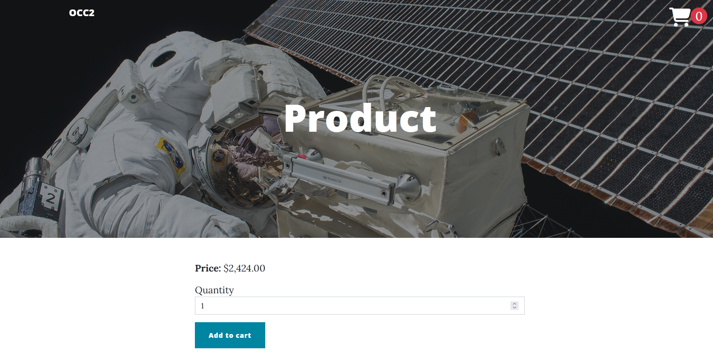

_A Product with excellent price to value ratio._

### Step 4 — Create a Product List

Listing the available products is another expected feature for a webshop. This can be done in multiple ways, but let's see a simple one that includes a content type which utilizes the Commerce module's `ProductListPart`. Go to _Content > Content Types_ and create a new type with the name Product List. Add `TitlePart`, `ProductListPart`, and `AutoroutePart` to it. Listing the products is taken care of by `ProductListPart`, which requires no additional configuration, and the basic settings are up to preferences.

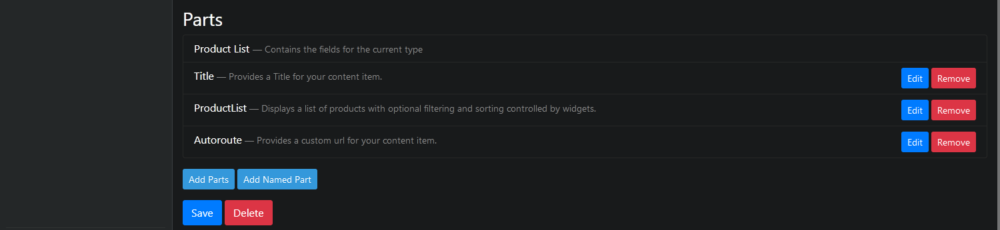

_This approach only requires using a few parts with no extra configuration steps._

Optionally, edit the `AutoroutePart`'s configuration to allow setting the Product List as the homepage.

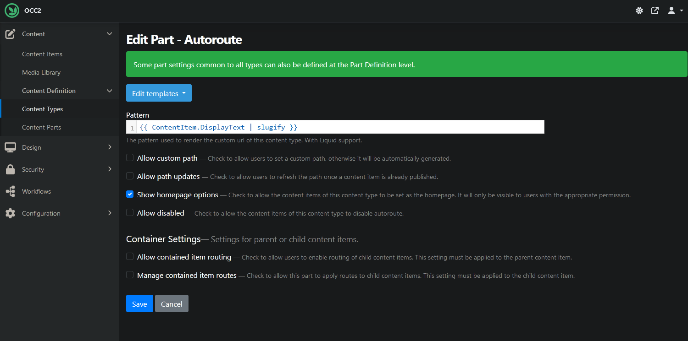

_Check Show homepage options. Or don't, up to you._

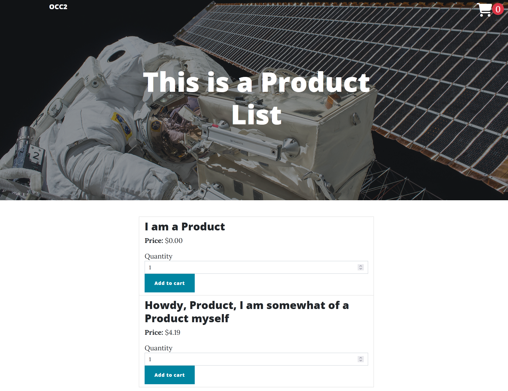

_Listing available Products makes browsing easier for customers._

### Step 5 — Create Shopping Cart Widget

Shopping without a shopping cart is a difficult task: while it's not outside the realm of possibility, let's make our lives easier by creating one. For this, we're going to need to create Zones, Layers, and finally a Widget.

- **Zones**:
Navigate to _Design > Settings > Zones_ and define the zone where you want the Shopping Cart Widget to be rendered. Make sure to use zones that are also referenced by your Layout. To learn more about Zones, refer to their [documentation](https://docs.orchardcore.net/en/main/docs/reference/modules/Layers/#zones).

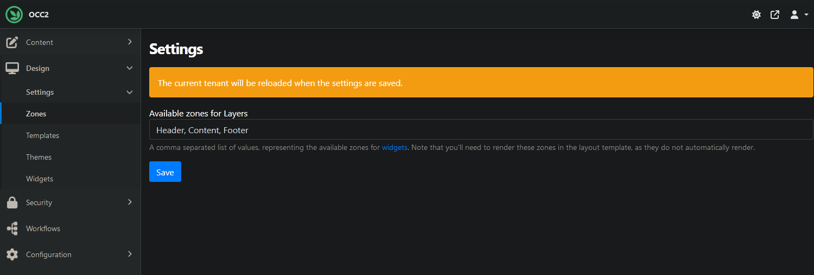

_Header, Content, Footer, any zone can be created here. Except for Ozone, that's illegal._

- **Layers**:
A Layer is also going to be necessary for the Widget, so if you don't have one set up yet, see the [relevant documentation page](https://github.com/OrchardCMS/OrchardCore/tree/main/src/docs/reference/modules/Layers/).

- **Widget**:
Widgets are content items that have their stereotype set to Widget. The Commerce module creates a simple Shopping Cart Widget when it's enabled, so we'll just use that. For more extensive documentation about Widgets, see the [usual place](https://docs.orchardcore.net/en/main/docs/reference/modules/Widgets/).

To actually add a Widget, return to the _Design > Widgets_ page. Click the Add Widget button that's within the Zone of your choice, and select Shopping Cart Widget.

_Any content type with the Widget stereotype can be added this way, but let's just stick to the shopping cart._

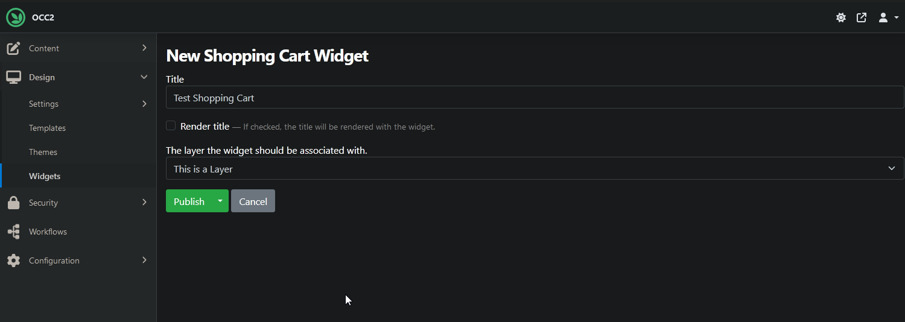

_Name the Widget and select the Layer where it should be rendered._

### Step 6 — Enable a payment provider (Exactly)

> ℹ If Exactly is not available in your region [try Stripe instead](../features/exactly-payment.md), the other payment provider OCC has built-in integration for.

Having Products and being able to browse them is great and all, but customers will also need a way to checkout and pay for their cart's content. This is where payment providers come into the picture. We will use Exactly, the default built-in payment provider. Ensure the **Orchard Core Commerce - Payment - Exactly** feature is enabled, then go to _Configuration > Commerce > Exactly API_. The Project ID and API Key fields need to be filled in sp payments are directed towards your account.

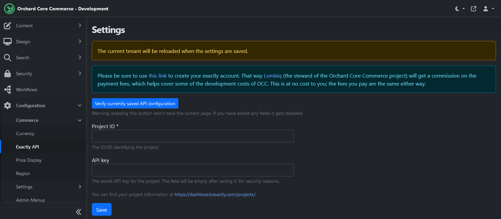

_See the links on the settings page and the [feature documentation](../features/exactly-payment.md) for info if you haven't got your keys yet._

Once you're saved the settings, feel free to click on the _Verify currently saved API configuration_ to test your API access. With that done, the _Pay with exactly_ button now appears on the checkout page which redirects the customer to the payment processor's site and then if everything went well sends them back to the success page.

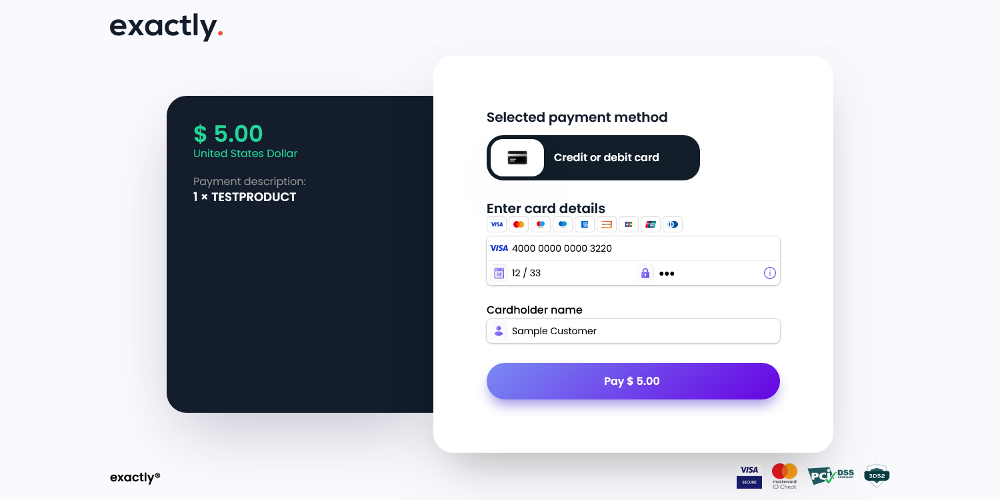

_This will allow customers to pay to their card's content._

## Other useful Commerce features

### Order management

Orders contain all data related to the transaction that triggered their creation. Just like most things in Orchard, Orders are content items, and they are automatically created when a user checks out. They can also be created manually on the dashboard.

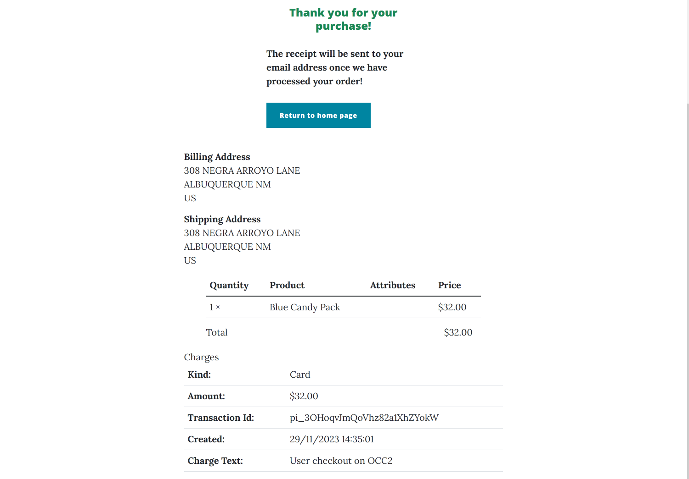

_Orders include all sorts of information about the transaction, including charges._

To create Orders manually, head to the usual _Content > Content Items_ page and select Order from the New button's dropdown menu.

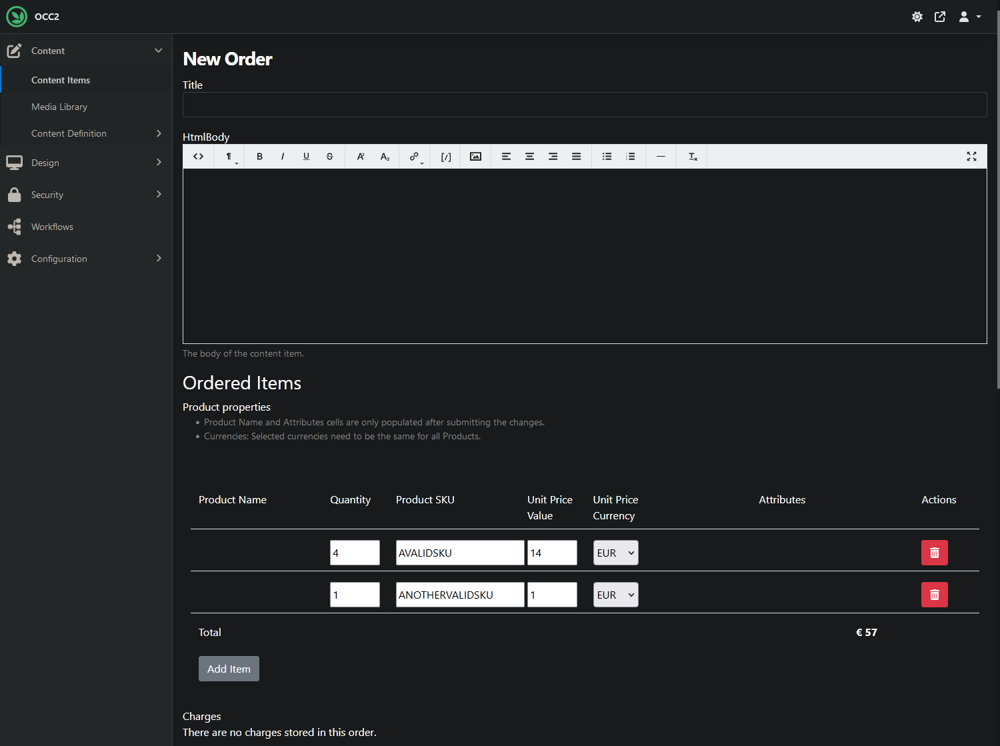

_Products can be added to and removed from any Order manually._

### Price Variants Products

Products that have `PriceVariantsPart` attached to them can have multiple different prices associated with them based on predefined attributes. This is handy when there are variants of the given product and you want to set different prices for each version. These prices are generated based on those Text Product Attribute Fields of the content type that are restricted to predefined values. For a more technical overview, see the [part's documentation](../features/price-variants-part.md).

Create a new product type, or edit an existing one, and attach `PriceVariantsPart` to it. Then add a new Text Product Attribute Field to it.

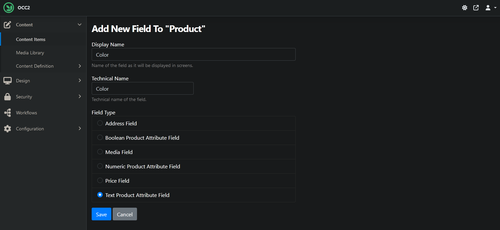

_Name the field at will, but make sure to choose the right field type._

Next, edit the newly added field's settings, fill out the Predefined values box and tick the Restrict to predefined values checkbox.

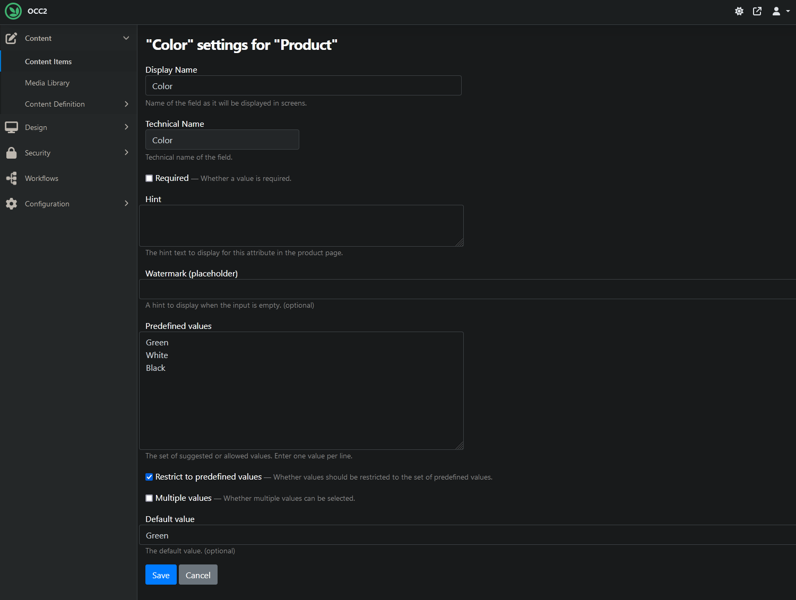

_While optional, the Default value field might be useful as well._

When creating a new Product with these settings, multiple prices can be specified.

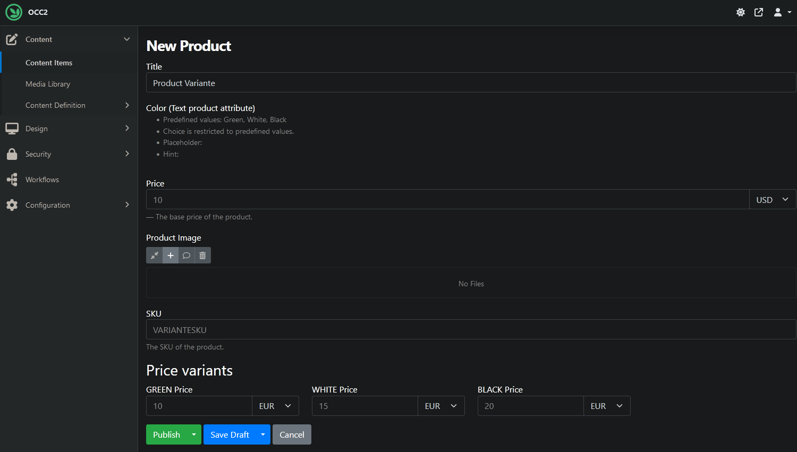

_Apart from the base Price, multiple different prices can be provided._

Now the variants can be selected from when viewing the Product.

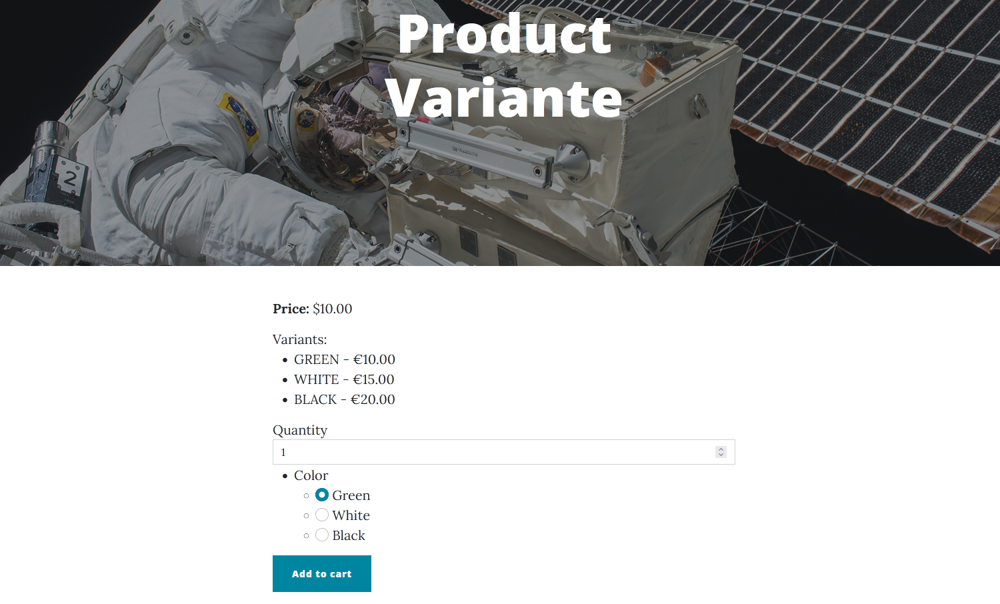

_With these settings, one variant may be chosen and added to the cart. Different settings could allow multiple choices as well._

### Taxation

The module comes with basic tax support capabilities that include specifying gross prices and tax rates on products. These can be utilized by attaching `TaxPart` to content types that also have `ProductPart`. For a detailed overview of the feature, see its [documentation](../features/taxation.md).

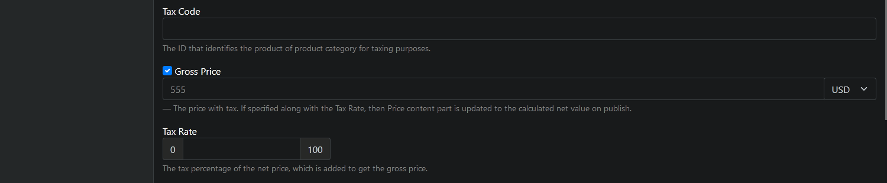

_With `TaxPart` present, these fields become available in the content item's editor._

### Promotions

Setting discounts for products is also possible by attaching `DiscountPart` to a type. This enables specifying discount amounts/percentages, as well as the scale and duration of the discount. Global discounts that apply to all products in the shop are also possible to create by using the `GlobalDiscount` stereotype. As previously, see the feature's [documentation](../features/promotions.md) for details.

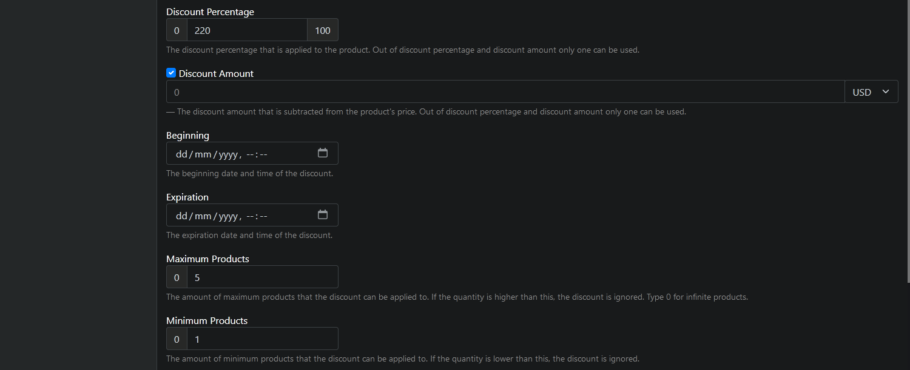

_Start and end dates can be set for discounts as well._

### Inventory management

Basic inventory management capabilities are also present in the Commerce module via the Inventory feature, which not only keeps inventory of products that have `InventoryPart` attached, but also includes settings for back ordering and allowed order quantities. Find more details on the feature's [documentation page](../features/inventory.md), as well as on the `InventoryPart` [documentation page](../features/inventory-part.md).

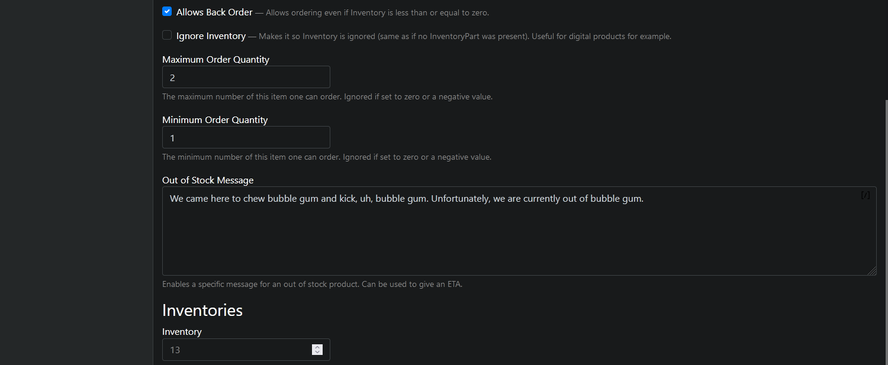

_These inventory-related fields show up in the editor after the `InventoryPart` has been attached, along with a checkbox to bypass them entirely if needed._

## Video

For a more visual presentation of a simple webshop, [check out the relevant recording](https://www.youtube.com/watch?v=SQHVUUUT8O0) from the 2023 Orchard Harvest below.
<!-- markdownlint-disable-next-line MD033 -->
<iframe width="560" height="315" src="https://www.youtube-nocookie.com/embed/SQHVUUUT8O0" title="YouTube video player" frameborder="0" allow="accelerometer; autoplay; clipboard-write; encrypted-media; gyroscope; picture-in-picture" allowfullscreen></iframe>
